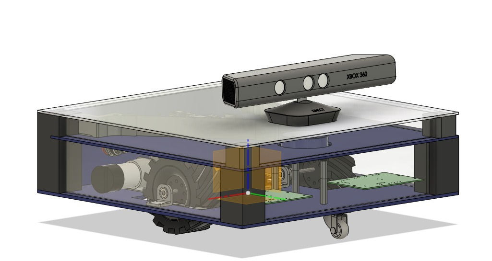

Basic Project Overview
======================

The Project MR-ROBOT is an autonomous robot that is designed to navigate its environment using the ROS (Robot Operating System) navigation stack. 
The project is made keeping modularity in mind, which means that it is built with interchangeable parts that can be customized to suit different use cases.

The MR-ROBOT project is built on top of the ROS navigation stack, which is a collection of software packages that provide navigation and mapping capabilities 
for robots. This allows MR-ROBOT to use sensors such as LIDAR, cameras, and inertial measurement units to accurately navigate its surroundings and avoid obstacles.

One of the key benefits of the MR-ROBOT project is its modularity. This means that it can be customized to suit a wide range of applications, from warehouse 
automation to medical robotics. This modularity is achieved through the use of interchangeable parts and components, such as sensors, manipulators, and end-effectors.

The MR-ROBOT is an exciting development in the field of autonomous robotics, as it combines the power of the ROS navigation stack with the flexibility of 
a modular robot design. By leveraging these technologies, the MR-ROBOT project has the potential to revolutionize a wide range of household and medical applications, 
from Cleaning and Sanitation to transportation. The only limit is your imagination of things that you could do with it.

.. toctree::
   :maxdepth: 2

   ./working.rst
   ./launch.rst
   ./bash.rst

