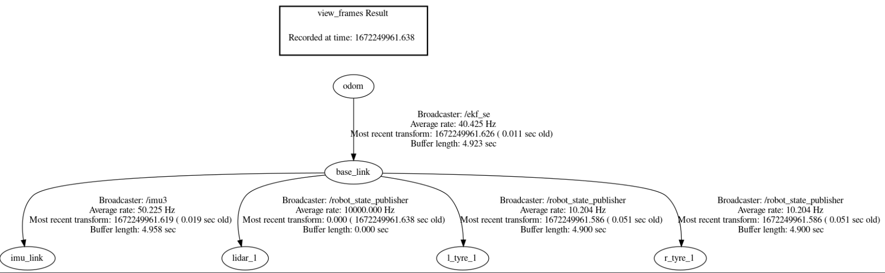
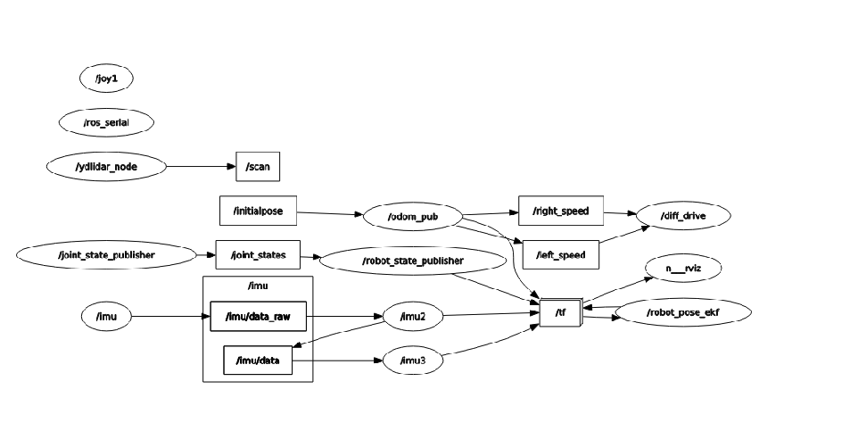

Working Of MR Robot
===================

Hardware Working
----------------

.. figure:: MRCKT.png

    MR Robot Circuit Diagram

MR Robot is a robot that is equipped with two encoder motors, an ESP32 microcontroller, a Raspberry Pi 4, an IMU, a LiDAR, a motor driver, and a 5V buck converter. The robot is designed to calculate the movement of the motors and send it to the microcontroller. The data is then published to a topic and used to calculate the odometer. The LiDAR and IMU are linked to the Raspberry Pi 4, and the motor driver is used to form an H-bridge for differential drive.

**Encoder Motors** :-
MR Robot is equipped with two encoder motors. The encoder motor calculates the movement of the motor and sends it to the microcontroller. This data is then used to calculate the odometer.

**ESP32 Microcontroller** :-
The ESP32 microcontroller is the brain of the robot. It receives data from the encoder motors and processes it. The microcontroller then publishes the data to a topic that is used to calculate the odometer.

**Raspberry Pi 4** :-
The Raspberry Pi 4 is used to link the LiDAR and IMU. The LiDAR and IMU are connected to the Raspberry Pi 4, which processes the data from the sensors.

**IMU** :-
The IMU is used to measure the orientation, acceleration, and angular velocity of the robot. The data from the IMU is processed by the Raspberry Pi 4 using a Kalman filter. The Kalman filter is used to estimate the orientation, acceleration, and angular velocity of the robot.

**LiDAR X2L Model** :-
The LiDAR X2L Model is a type of LiDAR sensor that is used to detect the distance and angle of objects in the environment. The LiDAR X2L Model is connected to the Raspberry Pi 4 and is used to create a map of the environment.

**Motor Driver** :-
The motor driver is used to form an H-bridge for differential drive. The motor driver is connected to the microcontroller and the encoder motors. The motor driver is responsible for controlling the speed and direction of the motors.

**5V Buck Converter** :-
The 5V Buck Converter is used to convert the voltage from the battery to 5V.

**Conclusion** :-
MR Robot is a sophisticated robot that is equipped with advanced sensors and components. The robot is designed to navigate the environment using the LiDAR, IMU and Encoder Motor. The motor driver is used to control the movement of the robot, and the microcontroller is used to process the data from the sensors. Overall, Mr. Robot is a powerful and versatile robot that is capable of performing a wide range of tasks.

Software Working
----------------

.. figure:: MRDFD.png

    MR Robot DFD

MR Robot is a robot that utilizes the ROS Serial protocol to communicate with its components. It uses Twist to PWM for motor control and ESP_Diff_TF for odom calculation. The robot has a LiDAR sensor connected to the Raspberry Pi 4, which is used for mapping and navigation.

**ROS Serial Protocol** :-
ROS Serial is a protocol used to communicate with the robot's components, such as the microcontroller and motor driver. It allows for the exchange of messages between the robot and the computer. This protocol is used to send and receive data from the robot, such as motor commands and sensor data.

http://wiki.ros.org/rosserial

**Twist to PWM** :-
The Twist to PWM converter is used to control the speed and direction of the robot's motors. It takes in Twist messages, which represent the desired linear and angular velocities of the robot, and converts them to PWM signals that are sent to the motor driver.

**ESP_Diff_TF** :-
The ESP_Diff_TF node is used to calculate the robot's odometry. It takes in the encoder data from the motor driver and uses it to calculate the robot's position and orientation. The calculated odometry data is then sent to the Navigation Stack.

**AMCL** :-
The Adaptive Monte Carlo Localization (AMCL) node is used to localize the robot within a map. It takes in sensor data, such as the LiDAR data from the Raspberry Pi 4, and uses it to estimate the robot's position within the map. AMCL is a part of the Navigation Stack and is responsible for accurately determining the robot's position.

http://wiki.ros.org/amcl

**Move Base** :-
The Move Base node is used for robot navigation. It takes in a goal location and uses the odometry and localization data from AMCL to navigate the robot to the goal location. Move Base utilizes a global planner and a local planner to plan a path to the goal and avoid obstacles in real-time.

http://wiki.ros.org/move_base

**LiDAR Data** :-
The LiDAR data from the Raspberry Pi 4 is used for mapping and navigation. The LiDAR sensor scans the environment and creates a 2D map of the surroundings. This map is then used by the Navigation Stack to determine the robot's position and plan a path to the goal.

https://www.ydlidar.com/products/view/6.html

**GMapping** :-
The LiDAR data from the Raspberry Pi 4 can also be used for mapping using the GMapping node. GMapping is a SLAM algorithm that uses the LiDAR data to create a map of the environment. The generated map can then be used for navigation by the Navigation Stack.

http://wiki.ros.org/gmapping

**Conclusion** :-
MR Robot is a powerful and sophisticated robot that utilizes ROS Serial, Twist to PWM, and ESP_Diff_TF for motor control and odometry calculation. The Navigation Stack, which includes AMCL and Move Base, is used for robot navigation and localization. The LiDAR data from the Raspberry Pi 4 is used for mapping and navigation by the Navigation Stack, and can also be used for mapping using GMapping. Overall, Mr. Robot is a versatile and capable robot that is suitable for a wide range of tasks.

TF TREE
--------

    TF TREE

Node Graph
-----------

    Node Graph
