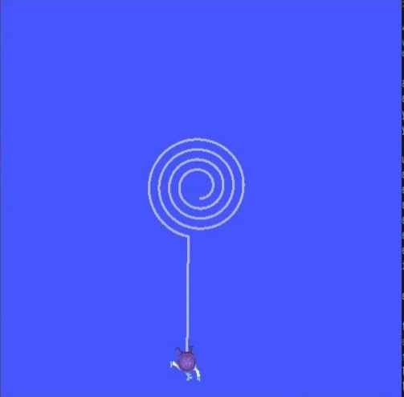

ROS Selection Task 2024-2025
============================

Problem statement
-----------------

-  The objective of the task is to move the turtle inside the turtlesim 
   window in a vertical Candy shape 

-  To acheive this task you are supposed to create a node named
   /node_turtle_move within a python script,
   node_turtle_move.py

   Dont worry if you are new to ROS or Linux(Ubuntu), the task
   is fairly simple and we have provided you with ample resource and
   tutorials in this WIKI to the complete this task so only a strong
   will and a little bit of brains is required to get the work done.
   Also even though this just a weekend task we have provided ample
   amount of time as we also have our midterm exams during this time. So
   we think a week time is enough so you guys can give your exams freely
   and manage your time in order to complete the task

.. Note:: All the resources to complete the said task are provided in
   the ROS section of ATOM WIKI. So make sure to check it out if you are
   new to ROS2.

.. Warning::
   The **Deadline** for completing the task is **15th October, 2024**.

Expected Output
---------------
`video link <https://www.youtube.com/shorts/R6udlXtyplk>`__

.. raw:: html

   
<iframe width="560" height="315" src="https://www.youtube.com/embed/R6udlXtyplk" title="YouTube video player" frameborder="0" allow="accelerometer; autoplay; clipboard-write; encrypted-media; gyroscope; picture-in-picture" allowfullscreen></iframe>
 

.. caution:: THE Candy SHOULD BE VERTICAL .

Hints
-----

-  The turtle needs to move in a vertical Candy shape .

-  You can refer `POSE <https://docs.ros.org/en/noetic/api/geometry_msgs/html/msg/Pose.html>`__ to learn more about pose function.

-  You can refer `TWIST <https://docs.ros.org/en/noetic/api/geometry_msgs/html/msg/Twist.html>`__ to learn more about twist function.

-  Use linear velocity and angular velocity to get this done.

-  Keep tracking the distance travelled so as to know when to stop. You
   can refer to Overview of rospy for more hint

Sample Code Snippet
-----------------------

**Question:** Write a python code to move ROS's turtlesim bot on a straight path 
while bot's distance is less than 6.

.. code-block:: python

   #!/usr/bin/env python3

   import rclpy
   from rclpy.node import Node
   from geometry_msgs.msg import Twist
   from turtlesim.msg import Pose

   my_X = 0.0
   my_Y = 0.0
   x_dist = 8.0

   # Subscriber callback that gives the position of the turtle (x & y)
   def pose_callback(pose):
      global my_X, my_Y
      my_X = pose.x
      my_Y = pose.y
      node.get_logger().info(f"Robot X = {pose.x}: Robot Y = {pose.y}")

   class MoveTurtle(Node):
      def __init__(self, lin_vel):
         super().__init__('move_turtle')
         self.publisher_ = self.create_publisher(Twist, '/turtle1/cmd_vel', 10)
         self.subscriber_ = self.create_subscription(Pose, '/turtle1/pose', pose_callback, 10)
         self.lin_vel = lin_vel
         self.timer = self.create_timer(0.1, self.move_callback)  # 10hz
         self.vel_msg = Twist()

      def move_callback(self):
         global my_X, x_dist

         # Set the linear velocity
         self.vel_msg.linear.x = self.lin_vel
         self.vel_msg.linear.y = 0.0  # Ensure this is a float
         self.vel_msg.linear.z = 0.0  # Ensure this is a float
         self.vel_msg.angular.x = 0.0
         self.vel_msg.angular.y = 0.0
         self.vel_msg.angular.z = 0.0

         self.get_logger().info(f"Linear Vel = {self.lin_vel}")

         # Stop the turtle when it reaches x_dist
         if my_X >= x_dist:
               self.get_logger().info("Turtle Reached destination")
               self.get_logger().warn("Stopping Turtle")

               # Set the velocity to zero to stop the turtle
               self.vel_msg.linear.x = 0.0
               self.publisher_.publish(self.vel_msg)
               rclpy.shutdown()
         else:
               self.publisher_.publish(self.vel_msg)

   def main(args=None):
      rclpy.init(args=args)

      lin_vel = 2.0  # Set linear velocity
      global node
      node = MoveTurtle(lin_vel)

      try:
         rclpy.spin(node)
      except KeyboardInterrupt:
         pass
      finally:
         node.destroy_node()
         rclpy.shutdown()

   if __name__ == '__main__':
      main()

Output video
-----------------------

.. raw:: html

   
<iframe width="560" height="315" src="https://www.youtube.com/embed/tjGNhEe-S_k" title="YouTube video player" frameborder="0" allow="accelerometer; autoplay; clipboard-write; encrypted-media; gyroscope; picture-in-picture" allowfullscreen></iframe>
 

Commands used:

.. code:: shell

   ros2 run turtlesim turtlesim_node
   ros2 run package_name script_name

Procedure
---------

Follow the instructions given below to get started with the task.

-  First, you will need to create a package named selection_task within
   your ROS workspace. Once your package is created, source and build
   your workspace.
-  Within this package, you should have a 'scripts' folder inside which
   you'll create a python script, named node_turtle_move.py.
-  Fill the script with proper programming ethics. Doing this will help
   us understand your code better and quicker than usual.
-  After completing the python script. Make it executable, if it isn't
   already. To do that, enter the following code.

.. code:: shell

   cd ~/turtle_ws
   colcon_build
   source install/setup.bash

-  You can either run them in separate terminals or
   simply create a selection_task.launch file inside the
   ``~/turtle_ws/src/selection_task/launch/`` folder. Launch file can
   run multiple nodes unlike a python/cpp script. Run the launch file,
   enter, This should run three processes in parallel.

-  turtlesim_node

-  node_turtle_move.py

.. seealso::
   Please refer to the tutorials and resouces given in the wiki or visit
   the official `ROSWIKI <http://wiki.ros.org/Documentation>`__ if you
   need help with anything regarding ROS2.

Head over to `Submissions <./submissions.rst>`__ to submit your work 