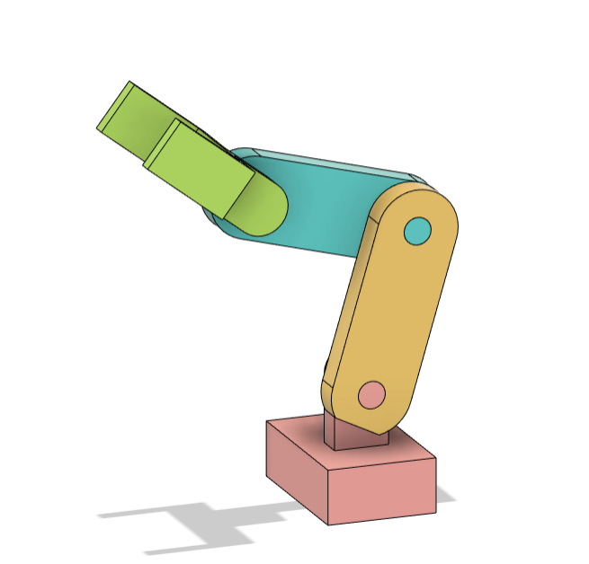

CAD Selection Task: Standard Instructions
=========================================

The TASK provided here is the selection criteria for joining the
**A.T.O.M** society. Those who sucessfully finish the task within the
given time frame will be eligible to give an interview and eventually
become a member of the **A.T.O.M** society.

-  The tasks are not only to test your problem solving skills but also
   to see your diligence to learn new stuff the ablity to get the work
   done.

-  You will be required to finish **Two** tasks in the alloted time
   frame. Both of them are supposed to be done in any 3d modeling
   software preferably **Fusion360**.

-  If there are any 3D Designs or any other previous works (even 2d
   sketches are fine) related to the stuff you have worked on, you are
   welcome to share those as well with your submissions. It is optional,
   but this would help us further see your creativity and skills.

Hints / Reference 
-----------------
.. raw:: html

   
<iframe width="560" height="315" src="https://www.youtube.com/embed/Ha6Ph8siaNc?si=gpTC5cUOt2XAEKaa" title="YouTube video player" frameborder="0" allow="accelerometer; autoplay; clipboard-write; encrypted-media; gyroscope; picture-in-picture; web-share" allowfullscreen></iframe>
 

Task 1 : 5pts
-------------

Problem statement
^^^^^^^^^^^^^^^^^
-  The objective of the task is to make a 3D model of a part using the
   given engineering drawing.

-  To achieve this task you may use any method but the end result should
   be as close as possible to the original drawing.

-  You will be judged on the basis of your way of designing, so keep
   that in mind and make sure to follow proper practices(Like using
   constraints appropriately).

.. Note:: You may use any software that you are familiar with but you
   are recommended to use **Fusion360**.

Expected Output
^^^^^^^^^^^^^^^

.. raw:: html

   

.. raw:: html

   

.. raw:: html

   

Task 2: 5pts
--------------
.. raw:: html

   

.. raw:: html

   

Problem statement
^^^^^^^^^^^^^^^^^

-  The objective of the task is to create or draw an eg/cad drawing for the following displayed below.

-  To acheive this task you are supposed to create a project in autocad and and make the desired output.

Description
^^^^^^^^^^^
- The 3-DOF arm with simple joints is a versatile mechanical system featuring three degrees of freedom, allowing for a wide range of motion. This design focuses on fundamental movement capabilities, simplifying control and design while offering flexibility for various introductory robotic applications.
- You will be judged on the basis of the following criteria:

   **The judging criteria for CAD selection tasks will include an evaluation of the design history of CAD during the interview.**
   
   - The judging criteria for CAD selection tasks will include an evaluation of the design history of CAD during the interview.
   - Manufacturability of the links and mounts (Preferebly 3d Printable)
   
   - Adhering to the giving details and guidelines.
   
   - Reusability and esay to modify in future if required.
   
   - You may use any methods and tools to achieve the task buy make sure to follow proper 3d modeling practices like constraints, joints etc.

.. Warning::
   The **Deadline** for completing the task: **15th October, 2024**. Make sure to submit the files in .step format.

Expected Output
^^^^^^^^^^^^^^^

`video link <https://www.youtube.com/watch?v=fbdGW2ZvFIM>`__

.. raw:: html

   
<iframe width="560" height="315" src="https://www.youtube.com/embed/fbdGW2ZvFIM" title="YouTube video player" frameborder="0" allow="accelerometer; autoplay; clipboard-write; encrypted-media; gyroscope; picture-in-picture; web-share" allowfullscreen></iframe>
 

.. raw:: html

   

.. raw:: html

   

 

..  caution:: THE DRAWING SHOULD BE DONE ACCURATELY AND AS EXPECTED .
   
Head over to `Submissions <https://atom-robotics-lab.github.io/wiki/markdown/selectiontask24/submissions.html>`__ to submit your work 