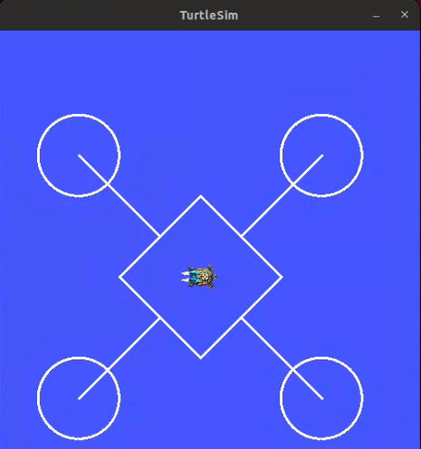

ROS Selection Task 2025-2026
============================

Problem statement
-----------------

-  The objective of the task is to move the turtle inside the turtlesim 
   window in a drone shape.

-  To acheive this task you are supposed to create a node named
   ``/node_turtle_move`` within a python script,
   ``node_turtle_move.py``

   Dont worry if you are new to ROS or Linux(Ubuntu), the task
   is fairly simple and we have provided you with ample resource and
   tutorials in this WIKI to the complete this task so only a strong
   will and a little bit of brains is required to get the work done.
   Also even though this just a weekend task we have provided ample
   amount of time so that you guys can freely manage your time in order 
   to complete the task.

.. Note:: All the resources to complete the said task are provided in
   the ROS section of ATOM WIKI. So make sure to check it out if you are
   new to ROS2.

.. Warning::
   The **Deadline** for completing the task is **26th September, 2025**.

Expected Output
---------------
`video link <https://www.youtube.com/shorts/R6udlXtyplk>`__

.. raw:: html

   
<iframe width="560" height="315" src="https://www.youtube.com/embed/R6udlXtyplk" title="YouTube video player" frameborder="0" allow="accelerometer; autoplay; clipboard-write; encrypted-media; gyroscope; picture-in-picture" allowfullscreen></iframe>
 

.. caution:: The DRONE should perfectly lie inside the turtlesim window. Also it is not necessary at all spawn to the drone in the turtlesim window instead you can continue with the default turtle spawned in the launch of the turtlesim window.

Hints
-----

-  The turtle needs to move in a Drone shape .

-  You can refer `POSE <https://docs.ros.org/en/noetic/api/geometry_msgs/html/msg/Pose.html>`__ to learn more about pose function.

-  You can refer `TWIST <https://docs.ros.org/en/noetic/api/geometry_msgs/html/msg/Twist.html>`__ to learn more about twist function.

-  Use linear velocity and angular velocity to get this done.

-  Use the premade topics and services of the turtlesim_node package to make the task easy. However you can always continue with your own custom topics and services. 

-  Keep tracking the position and distance travelled so as to perfectly draw the desired shape. You
   can refer to Overview of rclpy for more hint

Sample Code Snippet
-----------------------

**Question:** Write a python code to move ROS's turtlesim bot on a straight path 
while bot's distance is less than 3.

.. code-block:: python
      
      #!/usr/bin/env python3

      import rclpy
      from rclpy.node import Node
      from geometry_msgs.msg import Twist
      from turtlesim.msg import Pose
      import math

      class MoveTurtle(Node):

         def __init__(self):
            super().__init__('move_turtle')
            self.start_x = None
            self.start_y = None
            self.target_distance = 3.0  # Distance to move in pixels
            self.lin_vel = 2.0  # Linear velocity

            # Create a publisher for controlling the turtle's velocity
            self.pub = self.create_publisher(Twist, '/turtle1/cmd_vel', 10)
            # Create a subscriber for getting the turtle's position
            self.sub = self.create_subscription(Pose, '/turtle1/pose', self.pose_callback, 10)

         def pose_callback(self, pose):
            if self.start_x is None and self.start_y is None:
                  # Set the starting position when the first pose message is received
                  self.start_x = pose.x
                  self.start_y = pose.y
                  self.get_logger().info(f"Starting position set to X = {self.start_x:.2f}, Y = {self.start_y:.2f}")
            
            # Calculate the distance from the starting position
            distance = math.sqrt((pose.x - self.start_x) ** 2 + (pose.y - self.start_y) ** 2)
            self.get_logger().info(f"Distance from start = {distance:.2f}")

            # Create a Twist message to set the turtle's velocity
            vel = Twist()
            vel.linear.x = self.lin_vel
            vel.linear.y = 0.0
            vel.linear.z = 0.0
            vel.angular.x = 0.0
            vel.angular.y = 0.0
            vel.angular.z = 0.0

            if distance >= self.target_distance:
                  self.get_logger().info("Turtle reached the target distance")
                  vel.linear.x = 0.0  # Stop the turtle
                  self.get_logger().warn("Stopping Turtle")
                  self.pub.publish(vel)
                  rclpy.shutdown()
            else:
                  self.pub.publish(vel)

      def main(args=None):
         rclpy.init(args=args)
         move_turtle_node = MoveTurtle()
         rclpy.spin(move_turtle_node)
         move_turtle_node.destroy_node()
         rclpy.shutdown()

      if __name__ == '__main__':
         main()

Procedure
---------

* **Create Workspace** Open a terminal and create a new ROS 2 workspace named ``turtle_ws``:

   .. code:: shell

      mkdir -p ~/turtle_ws/src
      cd ~/turtle_ws/src

* **Create Python Package** Inside turtle_ws/src, create a new package named selection_task:

   .. code:: shell

      ros2 pkg create --build-type ament_python selection_task

   This will generate the basic package structure.

* **Add Python Files** Inside the selection_task/selection_task/ directory:

   * Ensure there’s an init.py file (can be empty)
   * Create:
      * ``node_turtle_move.py`` Complete your script ethically for the better understanding of the underlying concepts for drawing the desired shape .
   
   .. Your package structure should look like this:

   .. .. code:: text

   ..    turtle_ws/
   ..    └── src/
   ..       └── selection_task/
   ..          ├── selection_task/
   ..          │   ├── __init__.py
   ..          │   └── node_turtle_move.py
   ..          ├── package.xml
   ..          ├── setup.cfg
   ..          └── setup.py

* **Edit** To run both files with ros2 run, edit the setup.py so it contains:
   .. code:: shell

      entry_points={
         'console_scripts': [
               'node_turtle_move = selection_task.node_turtle_move:main',
         ],
      },

   Replace ``main`` with the actual function name that starts your node in each file.

* **Build the Workspace** From the root of your workspace:

   .. code-block:: bash

      cd ~/turtle_ws
      colcon build

 * Source the workspace:

   .. code-block:: bash

      source install/setup.bash

* **Run the Simulation**

 * Start Turtlesim

   .. code-block:: bash

      ros2 run turtlesim turtlesim_node
         
 * Run ``node_turtle_move.py`` in a new terminal:

   .. code-block:: bash

      cd ~/turtle_ws
      source install/setup.bash
      ros2 run selection_task node_turtle_move.py

-  After Running this script , you should probably see your turtle moving on the window while drawing the desired shape.

Running the Nodes
-----------------

* **Terminal Method** Open separate terminals for each node
* **Launch File Method** Create a launch file to run multiple nodes:

  - You can either run them in separate terminals or simply create a ``selection_task.launch.py`` file inside the ``~/turtle_ws/src/selection_task/launch/`` folder.
  - Launch files can run multiple nodes unlike a python/cpp script.
  - Run the launch file to execute two processes in parallel.

.. seealso::
   Please refer to the tutorials and resouces given in the wiki or visit
   the official `ROSWIKI <http://wiki.ros.org/Documentation>`__ if you
   need help with anything regarding ROS2.

Head over to `Submissions <https://atom-robotics-lab.github.io/wiki/markdown/selectiontask24/submissions.html>`__ to submit your work 