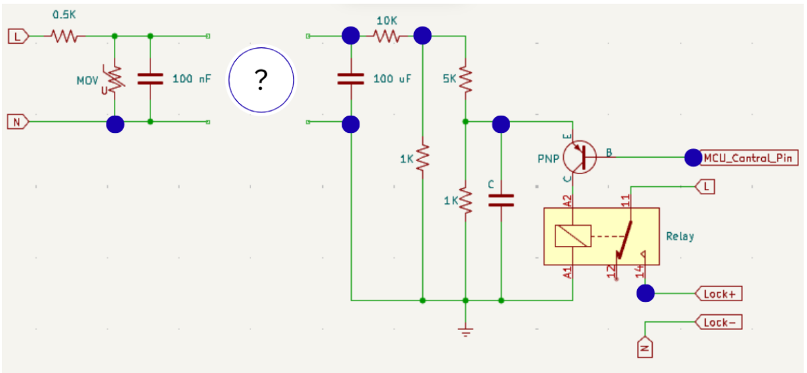

Electronics Selection Task 2026-2027
====================================

.. note::
   If you don't have hardware available, you can use a simulator such as `Wokwi <https://www.wokwi.com>`__ and `Tinkercad <https://www.tinkercad.com/>`__

This year, we've introduced a four-tiered Electronic Selection Task. Here's a brief summary:

**Challenge Tasks**

The electronic selection task is divided into four Tasks, labeled from Task 1 to Task 4. 
Each Task presents its distinct set of challenges. 
Whether you're a novice or an experienced enthusiast, there's something here for everyone.

**Scoring System**

To add an extra layer of excitement, each task within these Tasks carries a specific point value mentioned alongside 
the problem statement. Your performance will determine your score, and points will be awarded accordingly.

**Qualification Criteria**

To progress to the next stage, which is the interview phase, you must accumulate a minimum of 13 points in total. These 
points will be awarded after evaluating your submissions. Therefore, ensure you put your best foot forward for a chance to advance!

.. note::
   Note: For Task 1, 2, 3, and 4 use either Arduino UNO, or esp32 as your
   microcontroller to make the projects.
   Assemble all you components on a breadboard using jumper wires and
   resistors.

Task 1 - Getting Started: 5pts
-------------------------------

Task 1 serves as the foundation and includes following task:-

Task
^^^^^^^
Imagine you are enjoying a vacation on a beach along the pacific coast, where you are captured by the iron guards from the movie Doraemon: New Nobita and the Castle of the Undersea Devil. While imprisoned you discover a part of the internal circuitry of the prison cell as depicted in the figure. The circuit appears to have some missing parts and need to be manipulated for you to exit the cell and join doraemon to safely evacuate from the undersea kingdom.

Constraints
^^^^^^^^^^^^
* Cutting of power would alarm the iron guards of your activities.
* Disconnecting wrong wires would cause an emergency closure of the entire system following which no one can go out or come in.
* You have no other electronic equipment other than a few strips of wire and plastic strips.

Circuit Diagram
^^^^^^^^^^^^^^^^^

.. raw:: html

   

.. raw:: html

   

.. note::

   Lose connections that you can cut/change are depicted with blue circles
   (Note: The circuit can not be changed at any other connection of component/wire)

   Modify the circuit using the shortest, most logical method.

Task 2 - Challenges: 8pts
--------------------------
Task 2 elevates the complexity with more intricate problems and higher point allocations. Stay tuned for the list of tasks!

Task 
^^^^^^^
Using 3 GPIO pins of a microcontroller and 6 leds implement the falling sand pattern using the multiplexing technique known as charlieplexing.

Expected Output
~~~~~~~~~~~~~~~
`video link <https://youtube.com/shorts/ab3w8_wTiIk?si=MBE0CLLUcjJpmC8K>`__

.. raw:: html

   
<iframe width="560" height="315" src="https://www.youtube.com/embed/ab3w8_wTiIk?si=9cWUKpAPQBLv-wqv" title="YouTube video player" frameborder="0" allow="accelerometer; autoplay; clipboard-write; encrypted-media; gyroscope; picture-in-picture; web-share" referrerpolicy="strict-origin-when-cross-origin" allowfullscreen></iframe>
 

.. note::

   You may refer to above video link to understand the expected solution.

Task 3 - Expert Territory: 8pts
---------------------------------
This task will test even the most seasoned electronic enthusiasts. Prepare for some mind-bending tasks and 
substantial point rewards.

Task
^^^^^^^
Design and implement a circuit using a microcontroller of your choice to interface with an MPU6050 IMU and measure the tilt angles along the X, Y, and Z axes. 
Display the measured tilt angles on an OLED display. 
Additionally, use three indicator LEDs, one for each axis (X, Y, and Z), to represent the corresponding danger Task of tilt. 
Each LED should remain off below the lower danger threshold, turn on when the tilt angle exceeds 90°, and progressively increase in brightness as the angle approaches the upper danger limit of 180° in the respective direction.

Expected Output
~~~~~~~~~~~~~~~
`video link <https://youtu.be/Na9GDVxo680>`__

.. raw:: html

   
<iframe width="560" height="315" src="https://www.youtube.com/embed/Na9GDVxo680?si=BnGLjxZeIYXdqc_W" title="YouTube video player" frameborder="0" allow="accelerometer; autoplay; clipboard-write; encrypted-media; gyroscope; picture-in-picture; web-share" referrerpolicy="strict-origin-when-cross-origin" allowfullscreen></iframe>
 

Task 4 - A.T.O.M Special: 13pts
--------------------------------
The ultimate challenge! designed to push the boundaries of your electronics expertise, involving advanced 
problem-solving, precision circuit analysis, and high-reward challenges. 

Task Description:
^^^^^^^^^^^^^^^^
Using KiCAD software design and implement the schematic and PCB design of the TP4056 charging module.

----

.. note::
   Evaluation for this Task will primarily focus on your creativity and design efficiency.

.. Warning::
   The **Deadline** for completing the task: **15th September, 2026**

Head over to `Submissions <https://atom-robotics-lab.github.io/wiki/markdown/selectiontask26/04_submissions.html>`__ to submit your work 
