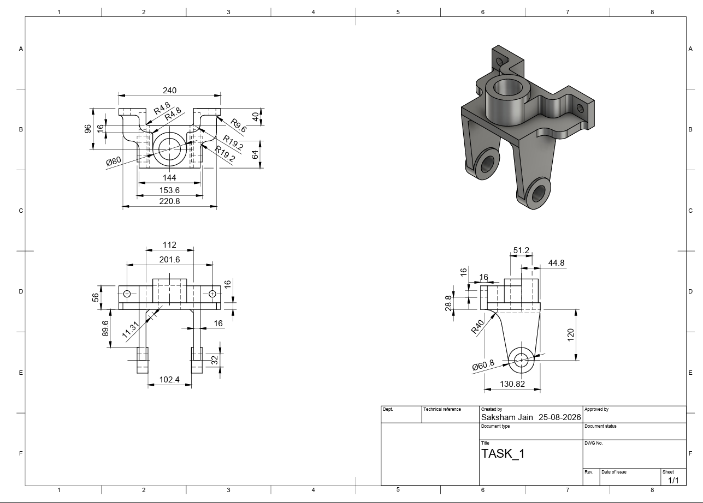
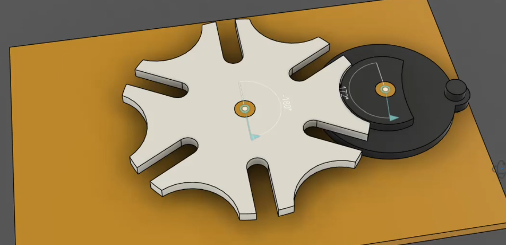
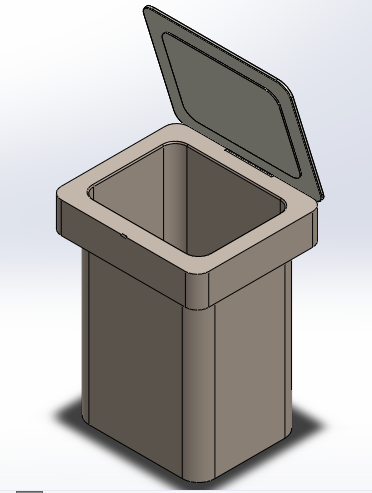

CAD Selection Task: Standard Instructions
=========================================

The TASK provided here is the selection criteria for joining the
**A.T.O.M** society. Those who sucessfully finish the task within the
given time frame will be eligible to give an interview and eventually
become a member of the **A.T.O.M** society.

-  The tasks are not only to test your problem solving skills but also
   to see your diligence to learn new stuff the ablity to get the work
   done.

-  You will be required to finish atleast **Two** tasks in the alloted time
   frame. Both of them are supposed to be done in any 3d modeling
   software preferably **Fusion360**.

-  If there are any 3D Designs or any other previous works (even 2d
   sketches are fine) related to the stuff you have worked on, you are
   welcome to share those as well with your submissions. It is optional,
   but this would help us further see your creativity and skills.

Hints / Reference 
-----------------
.. raw:: html

   
<iframe width="560" height="315" src="https://www.youtube.com/embed/Ha6Ph8siaNc?si=R5TmqYDl-geT5OPP" title="YouTube video player" frameborder="0" allow="accelerometer; autoplay; clipboard-write; encrypted-media; gyroscope; picture-in-picture; web-share" referrerpolicy="strict-origin-when-cross-origin" allowfullscreen></iframe>
 

Task 1 : 5pts
-------------

Problem statement
^^^^^^^^^^^^^^^^^
-  The objective of the task is to make a 3D model of a part using the
   given engineering drawing.

-  To achieve this task you may use any method but the end result should
   be as close as possible to the original drawing.

-  You will be judged on the basis of your way of designing, so keep
   that in mind and make sure to follow proper practices(Like using
   constraints appropriately).

.. Note:: You may use any software that you are familiar with but you
   are recommended to use **Fusion360**.

Expected Output
^^^^^^^^^^^^^^^

.. raw:: html

   

.. raw:: html

   

`video link <https://youtube.com/shorts/eZyMwtAAypY?si=OfeJd3N39agMjqVa>`__

.. raw:: html

   
<iframe width="560" height="315" src="https://www.youtube.com/embed/eZyMwtAAypY?si=NL63udGrqfJu8loD" title="YouTube video player" frameborder="0" allow="accelerometer; autoplay; clipboard-write; encrypted-media; gyroscope; picture-in-picture; web-share" referrerpolicy="strict-origin-when-cross-origin" allowfullscreen></iframe>
 

.. note::

   You may refer to above video link to get the better understanding of the expected solution.

Task 2: 5pts
--------------
.. raw:: html

   

.. raw:: html

   

Problem statement
^^^^^^^^^^^^^^^^^

-  The objective of the task is to make a 3D model of the moving mechanism.

-  To complete this task, you are required to design and develop a project in Fusion 360 that achieves the desired output.

Description
^^^^^^^^^^^
- The 6-slot Geneva drive is a precision intermittent motion mechanism that converts continuous rotary input from the driving wheel into stepped, indexed rotation of the driven wheel. In this system, a continuous 360° rotation of the drive disc engages a pin into the radial slot to advance the output wheel by 60°, while the raised crescent cam locks the driven wheel securely in place during the dwell phase to prevent backlash. This mechanical design is widely utilized in automated assembly lines, rotary indexing tables, and tool changers where reliable, discrete positioning is required without external electronic stepping.

Expected Output
^^^^^^^^^^^^^^^

`video link <https://youtu.be/8LOQrb4f_CU?si=hvqnrCyYwkxhbeTv>`__

.. raw:: html

   
<iframe width="560" height="315" src="https://www.youtube.com/embed/8LOQrb4f_CU?si=hvqnrCyYwkxhbeTv" title="YouTube video player" frameborder="0" allow="accelerometer; autoplay; clipboard-write; encrypted-media; gyroscope; picture-in-picture; web-share" referrerpolicy="strict-origin-when-cross-origin" allowfullscreen></iframe>
 

.. raw:: html

   

.. raw:: html

   

 

.. note::
      Advancement to the Personal Interview round requires completion of both mandatory tasks. To enhance 
      your selection prospects and distinguish yourself from other candidates, we strongly recommend completing the optional Task 3 as well.

Task 3: Open Innovation
-----------------------

Problem statement
^^^^^^^^^^^^^^^^^

-  The objective of this open-ended task is to design and model an automated or mechanically driven waste bin with an opening/closing flap lid in Autodesk Fusion.

-  The challenge is to **over-engineer the actuation mechanism** for opening and closing the lid, moving beyond conventional simple hinges.

-  You are free to use any creative mechanical linkage or drive system, such as:

   * Multi-bar linkages (four-bar, scissor mechanisms, etc.)
   * Gear trains or rack-and-pinion systems.

-  The submission should demonstrate:

   * A fully constrained CAD assembly with functional motion joints.
   * Feasible kinematic action ensuring the flap opens and closes without structural collisions.
   * Thoughtful structural design, part mounting, and clearance tolerances.

Reference Image
^^^^^^^^^^^^^^^
.. raw:: html

   

   **The judging criteria for CAD selection tasks will include an evaluation of the design history of CAD during the interview.**

- You will be judged on the basis of the following criteria:
   
   - Manufacturability of the links and mounts (Preferebly 3d Printable)
   
   - Adhering to the giving details and guidelines.
   
   - Reusability and esay to modify in future if required.
   
   - You may use any methods and tools to achieve the task buy make sure to follow proper 3d modeling practices like constraints, joints etc.

.. note::

   Above image is for reference only, you are free to design your own dustbin flap mechanism and its shape.

----

..  caution:: THE DRAWING SHOULD BE DONE ACCURATELY AND AS EXPECTED .

.. Warning::
   The **Deadline** for completing the task: **15th September, 2026**
   
Head over to `Submissions <https://atom-robotics-lab.github.io/wiki/markdown/selectiontask26/04_submissions.html>`__ to submit your work 
